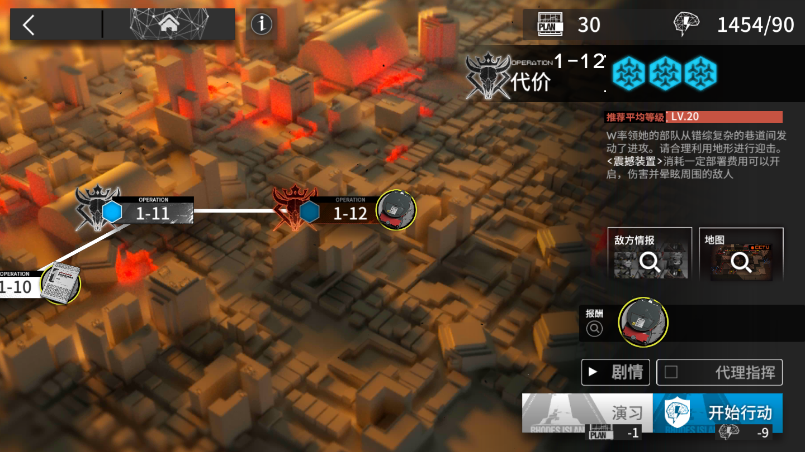

# ArkNights自动作战脚本

## 运行环境

+ python 3.6+
+ pytesseract
+ Pillow
+ ADB

## 使用方法

在cmd中直接运行`python ArkNights.py`即可

运行前，需先将运行环境设置好。设置方法如下：

1. pytesseract是开源的OCR识别库，此脚本识别行动是否结束的方法暂时为OCR识别

   pytesseract的安装方法详见jclian91的个人专栏：[Python图像处理之图片文字识别（OCR）](https://segmentfault.com/a/1190000015233393)

   安装完成后，需编辑`ArkNights.py`，将第六行的文件路径更改为你安装tesseract的路径。
   安装时记得添加简体中文语言包哦。
   
2. ADB的文件已经放在文件夹内，运行脚本前，请先将adb文件夹添加至环境变量

3. Pillow的安装方法：`pip install Pillow`

4. 运行脚本前，请先打开安卓模拟器。若使用MUMU模拟器，无需改动任何代码。若使用其他模拟器，则需要访问你所使用模拟器的官网，查看ADB连接模拟器的端口，并更改`adb_port`。如果是手机，Google一下吧。

5. 运行游戏，使游戏界面类似于下图：

   

6. 然后就可以运行脚本，自动作战啦！

## 想说的话

目前脚本处于刚开发的状态，有些功能尚不稳定。

现在判断行动是否结束的方式是：不断截图，对图片进行裁剪，对裁剪后的图片进行OCR识别。

已知可能发生的bug：

+ OCR识别，有时可能识别出错（OCR的锅，可不是我的哦。hhhhh）导致脚本卡在作战结束的状态。
+ 其他一系列未知的bug。

后期我打算增加以下功能：

+ 自动识别每次作战获得的材料并计数。
+ 识别作战结束的方式从OCR识别更换至CNN识别（虽然可能准确率还不如OCR，hhhhhhh）。
+ 自动记录每个副本所需的作战时间，在不更换代理指挥的情况下适当减少截图的次数。
+ 未记录过作战时间的副本考虑识别剩余敌军数量，在接近所有敌军数量的90%时再开始截图。

如果各位博士有更好的建议或者更好的想法，还有想增加的功能或者发现了我没发现的bug，请联系我哦！

联系方式在最底下。

## 注意！

为了实现CNN识别作战是否结束，我会将现在OCR识别的图片保存在`./image`中，如果可以的话，请各位博士在存储到20张图片时，将文件夹压缩发到我写在下面的邮箱里，我在这里谢谢各位博士了！祝你们每次寻访都六星！

## 联系方式

邮箱：744121249@qq.com

QQ：744121249

欢迎各位博士找我！
